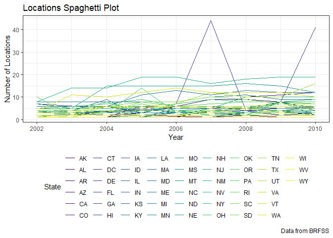
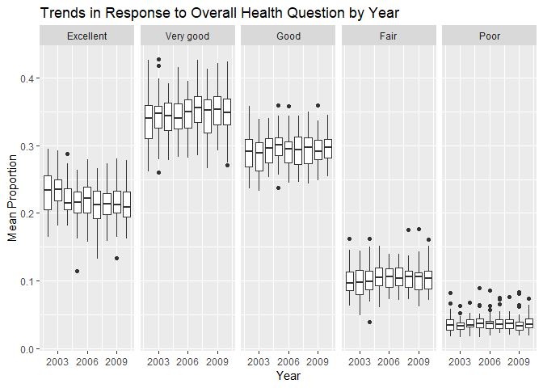
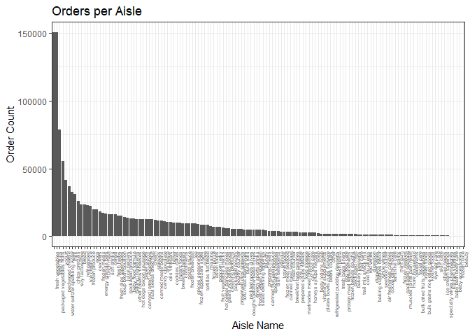
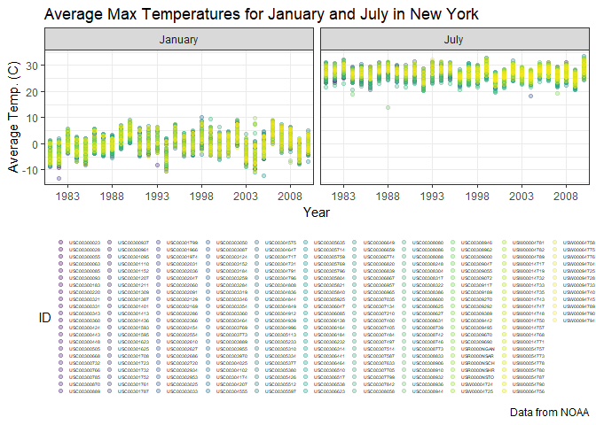
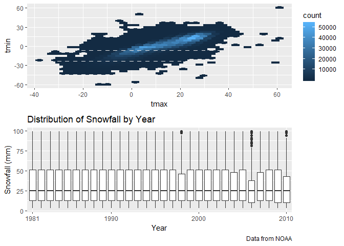

Homework 3
================
Christopher Crowe
October 5, 2018

Problem 1
---------

The following code chunk loads the BRFSS data and conducts the following steps:

-   clean variable names
-   focus on the "Overall Health" topic
-   include only responses from "Excellent" to "Poor"
-   organize responses as a factor taking levels from "Excellent" to "Poor"

``` r
devtools::install_github("p8105/p8105.datasets")
```

    ## Skipping install of 'p8105.datasets' from a github remote, the SHA1 (21f5ad1c) has not changed since last install.
    ##   Use `force = TRUE` to force installation

``` r
library(p8105.datasets)
data("brfss_smart2010")

brfss_data = brfss_smart2010 %>%
  janitor::clean_names() %>% 
  filter(topic == "Overall Health") %>% 
  filter(response == "Excellent" | response == "Very good" | response == "Good" | response == "Fair" | response == "Poor") %>%
  mutate(response = ordered(response, levels = c("Excellent", "Very good", "Good", "Fair", "Poor")))
```

Using this cleaned dataset, we can answer/perform the following questions/tasks of interest with the following code chunks:

### Part A

``` r
brfss_data %>% 
  filter(year == 2002) %>% 
  distinct(locationabbr, locationdesc) %>% 
  group_by(locationabbr) %>% 
  summarize(observed_locations = n()) %>% 
  filter(observed_locations == 7) %>% 
  knitr::kable()
```

| locationabbr |  observed\_locations|
|:-------------|--------------------:|
| CT           |                    7|
| FL           |                    7|
| NC           |                    7|

-   Q: In 2002, which states were observed at 7 locations?

-   A: According to the table above, Connecticut, Florida, and North Carolina each have observations from 7 distinct locations in 2002.

### Part B

``` r
brfss_data %>% 
  filter(year >= 2002 & year <= 2010) %>% 
  group_by(locationabbr, year) %>%  
  distinct(locationdesc) %>% 
  summarize(location_count = n()) %>%
  ggplot(aes(x = year, y = location_count, color = locationabbr)) +
    geom_line(size = 0.3) +
    labs(
      title = "Locations Spaghetti Plot",
      x = "Year",
      y = "Number of Locations",
      caption = "Data from BRFSS"
    ) +
    viridis::scale_color_viridis(
      name = "State",
      discrete = TRUE
    ) +
    theme_bw() +
    theme(legend.position = "bottom") +
    guides(color = guide_legend(nrow = 6))
```



-   Q: Make a spaghetti plot that shows the number of observations in each state from 2002 to 2010.

-   A: The above "spaghetti plot" shows how many locations were in each state by year, from 2002 to 2010. However, this graph is not very informative because it is difficult to distinguish the colors of the lines. While we can see that one state in particular had an unusually high number of locations in 2007, it is hard to tell which state corresponds to this color. Additionally, because there are so many lines on top of each other at the bottom of the graph, it is extremely difficult to distinguish one line from another.

### Part C

``` r
brfss_data %>% 
  filter(locationabbr == "NY" & response == "Excellent" & (year == 2002 | year == 2006 | year == 2010)) %>% 
  mutate(proportion_excellent = data_value / 100) %>% 
  group_by(year) %>% 
  summarize(mean_proportion_excellent = mean(proportion_excellent, na.rm = TRUE), sd_proportion_excellent = sd(proportion_excellent, na.rm = TRUE)) %>% 
  knitr::kable()
```

|  year|  mean\_proportion\_excellent|  sd\_proportion\_excellent|
|-----:|----------------------------:|--------------------------:|
|  2002|                    0.2404000|                  0.0448642|
|  2006|                    0.2253333|                  0.0400083|
|  2010|                    0.2270000|                  0.0356721|

-   Q: Make a table showing, for the years 2002, 2006, and 2010, the mean and standard deviation of the proportion of `Excellent` responses across locations in NY State.

-   A: From this table, we can see that the mean proportion of individuals in NY with excellent overall health has decreased from 0.24 in 2002 but has remained somewhat constant around 0.22 since 2006. Additionally, the standard deviation has steadily decreased by a small amount from 2002 to 2010.

### Part D

``` r
brfss_data %>% 
  mutate(proportion = data_value / 100) %>% 
  group_by(year, locationabbr, response) %>% 
  summarize(mean_proportion = mean(proportion, na.rm = TRUE)) %>% 
  ggplot(aes(x = year, y = mean_proportion, fill = locationabbr)) +
    geom_boxplot(aes(group = cut_width(year, 1))) +
    scale_x_continuous(breaks = c(2003, 2006, 2009)) +
    labs(
      title = "Trends in Response to Overall Health Question by Year",
      x = "Year", 
      y = "Mean Proportion"
    ) +
    facet_grid(~response)
```



-   Q: For each year and state, compute the average proportion in each response category (taking the average across locations in a state). Make a five-panel plot that shows, for each response category separately, the distribution of these state-level averages over time.

-   A: This five-panel plot shows us that the response to overall health is typically "Good" or "Very Good" across all states from 2002 to 2010. There is little variation among states with respect to the mean proportion of "Poor" responses, relative to the larger amount of variation seen in "Very Good" responses.

Problem 2
---------

The `instacart` dataset consists of 1384617 rows and 15 columns. This dataset contains a variety of information regarding food items sold in a store and relevant order details. The dataset is structured so that each row represents a unique combination of `order_id` and `product_id`. In other words, each row represents one product that was included in a given order, and the contents of the entire order span numerous rows that each begin with the same `order_id`. In addition to these two important variables, other variables of interest may include `user_id` (e.g., 112108, a unique ID given to the customer who placed the order), `product_name` (e.g., Bulgarian Yogurt, the full name of the product), and `department` (e.g., dairy eggs, the department of the store where the product can be found).

Using the `instacart` dataset, we can answer/do the following questions/tasks with the following code chunks.

### Part A

``` r
instacart %>% 
  distinct(aisle_id) %>% 
  nrow()

instacart %>% 
  group_by(aisle_id, aisle) %>% 
  summarize(order_count = n()) %>% 
  arrange(desc(order_count)) %>% 
  head(5) %>% knitr::kable()
```

-   Q: How many aisles are there, and which aisles are the most items ordered from?
-   A: There are 134 aisles. The table below shows the aisle ID and name from which the most items are ordered (top 5). Fresh vegetables and fresh fruits are at the top of the list with ~150,000 orders each, far exceeding the number of orders for the other top selling items.

|  aisle\_id| aisle                      |  order\_count|
|----------:|:---------------------------|-------------:|
|         83| fresh vegetables           |        150609|
|         24| fresh fruits               |        150473|
|        123| packaged vegetables fruits |         78493|
|        120| yogurt                     |         55240|
|         21| packaged cheese            |         41699|

### Part B

``` r
instacart %>% 
  group_by(aisle) %>% 
  summarize(order_count = n()) %>% 
  mutate(aisle = reorder(aisle, -order_count)) %>% 
  ggplot(aes(x = aisle, y = order_count)) +
    geom_col() +
    labs(
      x = "Aisle Name", 
      y = "Order Count", 
      title = "Orders per Aisle"
    ) +
    theme_bw() +
    theme(axis.text.x = element_text(angle = 90, hjust = 1, size = 5))
```



-   Q: Make a plot that shows the number of items ordered in each aisle. Order aisles sensibly, and organize your plot so others can read it.

-   A: The above plot shows the number of items ordered in each aisle, arranged in order of decreasing order count. Using this layout, it is easy to see that the fresh vegetables and fresh fruits aisles have the most orders by far. On the other hand, we can see that the beauty, frozen juice, and other aisles towards the right of the plot have very few orders.

### Part C

``` r
instacart %>% 
  filter(aisle == "baking ingredients" | aisle == "dog food care" | aisle == "packaged vegetables fruits") %>% 
  group_by(product_name, aisle) %>% 
  summarize(order_count = n()) %>% 
  arrange(desc(order_count)) %>% 
  group_by(aisle) %>% 
  top_n(n = 1, wt = order_count) %>% 
  rename(top_product_name = product_name) %>% 
  select(aisle, top_product_name, order_count) %>% 
  arrange(aisle) %>% 
  knitr::kable()
```

| aisle                      | top\_product\_name                            |  order\_count|
|:---------------------------|:----------------------------------------------|-------------:|
| baking ingredients         | Light Brown Sugar                             |           499|
| dog food care              | Snack Sticks Chicken & Rice Recipe Dog Treats |            30|
| packaged vegetables fruits | Organic Baby Spinach                          |          9784|

-   Q: Make a table showing the most popular item aisles `baking ingredients`, `dog food care`, and `packaged vegetables fruits`

-   A: According to the table above, the most popular items in the "baking ingredients", "dog food care", and "packaged vegetables fruits" aisles are Light Brown Sugar, Snack Sticks Chicken & Rice Recipe Dog Treats, and Organic Baby Spinach, respectively.

### Part D

``` r
instacart %>% 
  filter(product_name == "Pink Lady Apples" | product_name == "Coffee Ice Cream") %>% 
  select(product_name, order_dow, order_hour_of_day) %>% 
  group_by(product_name, order_dow) %>% 
  summarize(mean_order_time = mean(order_hour_of_day)) %>% 
  spread(key = order_dow, value = mean_order_time) %>% 
  knitr::kable()
```

| product\_name    |         0|         1|         2|         3|         4|         5|         6|
|:-----------------|---------:|---------:|---------:|---------:|---------:|---------:|---------:|
| Coffee Ice Cream |  13.77419|  14.31579|  15.38095|  15.31818|  15.21739|  12.26316|  13.83333|
| Pink Lady Apples |  13.44118|  11.36000|  11.70213|  14.25000|  11.55172|  12.78431|  11.93750|

Q: Make a table showing the mean hour of the day at which Pink Lady Apples and Coffee Ice Cream are ordered on each day of the week; format this table for human readers (i.e. produce a 2 x 7 table).

A: The above table is useful in comparing the times at which Pink Lady Apples and Coffee Ice Cream are ordered. For example, we can see that Pink Lady Apples are typically ordered earlier than Coffee Ice Cream. However, the table could be improved if we knew how days of the week were coded. As it is, we do not know which number corresponds to which day of the week, though we may assume Day 0 is either Sunday or Monday.

Problem 3
---------

The `ny_noaa` dataset consists of 2595176 rows and 7 columns. This dataset contains a variety of weather information recorded by weather stations across New York state. The dataset is structured so that each row represents the weather information for a particular weather station on any given day. Examples of key variables include `id` (e.g., US1NYAB0001, a unique ID given to each of the five NOAA weather stations in New York state), `date` (e.g., 2007-11-01, the day, month, and year on which the data was recorded), `prcp` (e.g., 3, the amount of precipitation in tenths of a millimeter), and `tmax` (e.g., -56, the maximum temperature in tenths of a degree Celsius). This dataset has a large number of missing values, with 1372743 observations where at least one piece of weather information is missing. This means that approximately 50% of all observations in this dataset have at least one piece of weather information missing.

Using the `ny_noaa` dataset, we can answer/do the following questions/tasks with the following code chunks.

### Part A

``` r
cleaned_ny_noaa = ny_noaa %>% 
  janitor::clean_names() %>% 
  separate(date, into = c("year", "month", "day"), sep = "-") %>% 
  mutate(prcp = prcp / 10, tmax = as.integer(tmax) / 10, tmin = as.integer(tmin) / 10)
```

``` r
cleaned_ny_noaa %>% 
  group_by(snow) %>% 
  summarize(freq = n()) %>% 
  arrange(desc(freq)) %>% 
  select(snow) %>% 
  head(1)
```

-   Q: Do some data cleaning. Create separate variables for year, month, and day. Ensure observations for temperature, precipitation, and snowfall are given in reasonable units. For snowfall, what are the most commonly observed values? Why?

-   A: With 2008508 observations, the most commonly observed value for snowfall is 0. This is likely due to the fact that most days of the year have no snowfall (i.e. it typically does not snow during the spring, summer, and fall)

### Part B

``` r
cleaned_ny_noaa %>% 
  filter(tmin != "NA" & tmax != "NA" & (month == "01" | month == "07")) %>% 
  mutate(month = month.name[as.integer(month)]) %>%
  group_by(id, year, month) %>% 
  summarize(monthly_avg_temp = mean(tmax)) %>%
  ggplot(aes(x = year, y = monthly_avg_temp, color = id)) +
    geom_point(alpha = 0.3) +
    scale_x_discrete(breaks = c(1983, 1988, 1993, 1998, 2003, 2008)) +
    labs(
      x = "Year",
      y = "Average Temp. (C)",
      title = "Average Max Temperatures for January and July in New York",
      caption = "Data from NOAA"
    ) +
    viridis::scale_color_viridis(
      discrete = TRUE,
      name = "ID"
    ) +
    theme_bw() +
    theme(legend.position = "bottom", legend.text = element_text(size = 4), legend.key.size = unit(1, "point")) +
    guides(color = guide_legend(nrow = 22)) +
    facet_grid(~month)
```



-   Q: Make a two-panel plot showing the average max temperature in January and in July in each station across years. Is there any observable/interpretable structure? Any outliers?

-   A: We can see a few things from the two-panel plot above. First, as expected, we can see that the average max temperature across all locations is lower in January (i.e. winter) than it is in July (i.e. summer). Additionally, we can see that there tends to be greater variation in average temperature across locations in January than in July. While it is difficult to distinguish specific locations due to the large number of weather stations included in the plot, we are able to see outliers. For example, we can see that one of the stations experienced a particularly cold January in 1993. Overall, it does not appear that there have been any major changes in average temperature over the years, aside from slight variations from year to year.

### Part C

``` r
temp_plot = cleaned_ny_noaa %>% 
  filter(tmax != "NA" & tmin != "NA") %>% 
  ggplot(aes(x = tmax, y = tmin)) + 
    geom_hex()

snowfall_plot = cleaned_ny_noaa %>% 
  filter(snow > 0 & snow < 100 & snow != "NA") %>% 
  ggplot(aes(x = year, y = snow)) +
    geom_boxplot() +
    scale_x_discrete(breaks = c(1981, 1990, 2000, 2010)) +
    labs(
      x = "Year",
      y = "Snowfall (mm)",
      title = "Distribution of Snowfall by Year",
      caption = "Data from NOAA"
    )

temp_plot / snowfall_plot
```



-   Q: Make a two-panel plot showing (i) `tmax` vs `tmin` for the full dataset; and (ii) make a plot showing the distribution of snowfall values greater than 0 and less than 100 separately by year

-   A: (i) The first plot shows us that as tmax increases, tmin also tends to increase. Additionally, we can see a high concentration of values with tmax around 25 degrees Celsius and tmin around 15 degrees Celsius. (ii) The second plot shows us that the distribution of snowfall has generally remained constant over the years, and the median in particular has always been around 25 mm. However, there have been a few years of abnormal snowfall (e.g. 2006).
